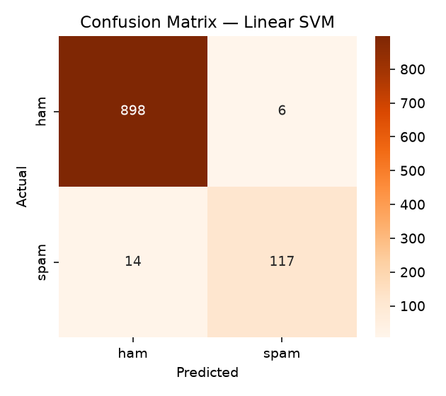

# SMS Spam Detector

Classifies SMS messages as **spam** or **ham** (not spam) using text preprocessing,
TF-IDF features and three linear classifiers, trained on the real
**UCI SMS Spam Collection**.



## Dataset
[SMS Spam Collection](https://archive.ics.uci.edu/dataset/228/sms+spam+collection)
(Almeida & Hidalgo, UCI Machine Learning Repository, CC BY 4.0): 5,574 real
English SMS messages labelled spam/ham, stored as `data/sms_spam.csv`.

After removing ~400 duplicate messages, 5,171 remain: **4,518 ham / 653 spam**.
The classes are imbalanced (~13% spam), so accuracy alone is misleading —
a model that always says "ham" would already score 87%. F1 on the spam class
is the main metric here.

## Approach
1. **Clean** — drop duplicates, lowercase, strip URLs and punctuation, remove stopwords.
2. **Split** — stratified 80/20 train/test split.
3. **Features** — TF-IDF over unigrams + bigrams (5,000 features, sublinear TF).
4. **Train & compare** three models:
   - Multinomial Naive Bayes
   - Logistic Regression (class-balanced)
   - Linear SVM (class-balanced)
5. **Evaluate** with accuracy, precision, recall, F1 and a confusion matrix.

## Results
Test set: 1,035 messages (904 ham, 131 spam).

| Model | Accuracy | Precision | Recall | F1 |
|---|---|---|---|---|
| **Linear SVM** | **0.981** | 0.951 | **0.893** | **0.921** |
| Logistic Regression | 0.969 | 0.861 | 0.901 | 0.881 |
| Multinomial Naive Bayes | 0.966 | **0.990** | 0.740 | 0.847 |

**Takeaways**
- **Linear SVM** gives the best balance: it catches ~89% of spam while only
  ~5% of its spam flags are wrong.
- **Naive Bayes** almost never marks a real message as spam (99% precision) but
  misses a quarter of spam — a reasonable choice if false alarms are very costly.

## Limitations
The dataset is from 2011, so modern phishing styles are under-represented. For example,
*"URGENT: verify your account now or it will be suspended today."* is classified
as ham, because 2011-era spam is mostly about prizes, ringtones and premium-rate numbers.
Training on newer data would be the next step.

## Run it yourself
```bash
pip install -r requirements.txt
python spam_detector.py     # trains, evaluates, writes outputs/
```

## Skills demonstrated
Text preprocessing, TF-IDF feature extraction, handling class imbalance,
model comparison, and choosing metrics (precision / recall / F1) that fit the problem.
